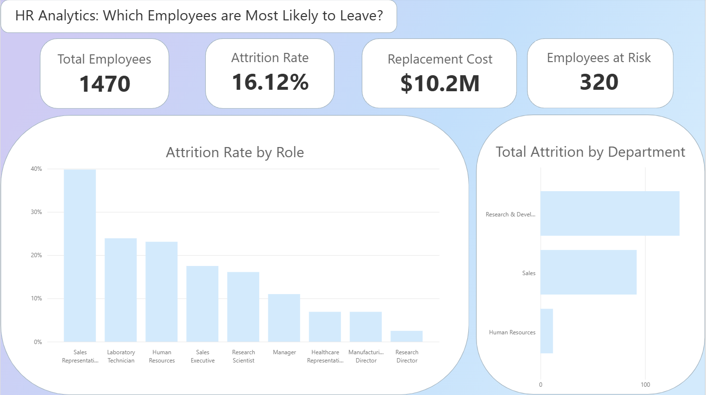
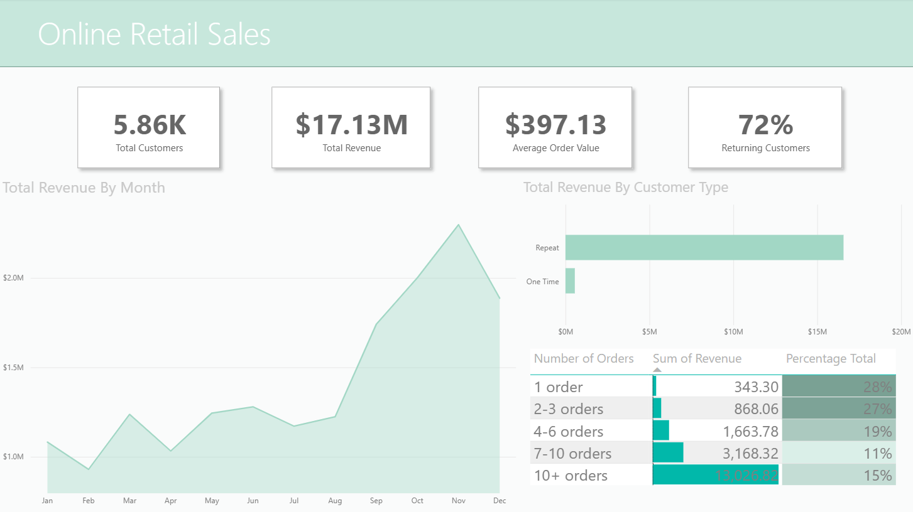
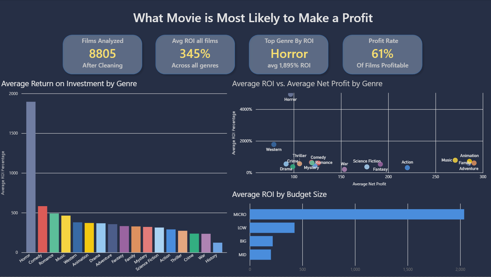

## Portfolio

---

### Data Analysis

[Employee Attrition Analysis: Predict Employees at Risk](https://medium.com/@johnhagaman21/employee-attrition-analysis-predict-employees-at-risk-aa74a8af2662)

---

[Uncovering the Customer Loyalty Gap in Online Retail](https://medium.com/@johnhagaman21/online-retail-sales-an-exploratory-data-analysis-9de143739197)

---

[Cinema By The Numbers: SQL and Power BI Visualization](https://medium.com/@johnhagaman21/cinema-by-the-numbers-a-movie-profitability-analysis-b1a9fdecaceb)

---

### Certifications

- [Google Data Analytics Professional Certificate](https://coursera.org/share/6c1b97e99dbc2f258c3bb6521b16cb73)
- [Microsoft Certified: Power BI Data Analyst Associate](https://learn.microsoft.com/api/credentials/share/en-us/JohnHagaman-5433/833F41722EFD80B5?sharingId=A35F0C29B4AF09BF)
- [Excel Skills for Business: Essentials](https://coursera.org/share/96b55ed44661ae597b97b296ad0f9ace)
- [Project 4 Title](http://example.com/)
- [Project 5 Title](http://example.com/)

---

---

Page template forked from <a href="https://github.com/evanca/quick-portfolio">evanca</a>

<!-- Remove above link if you don't want to attibute -->
